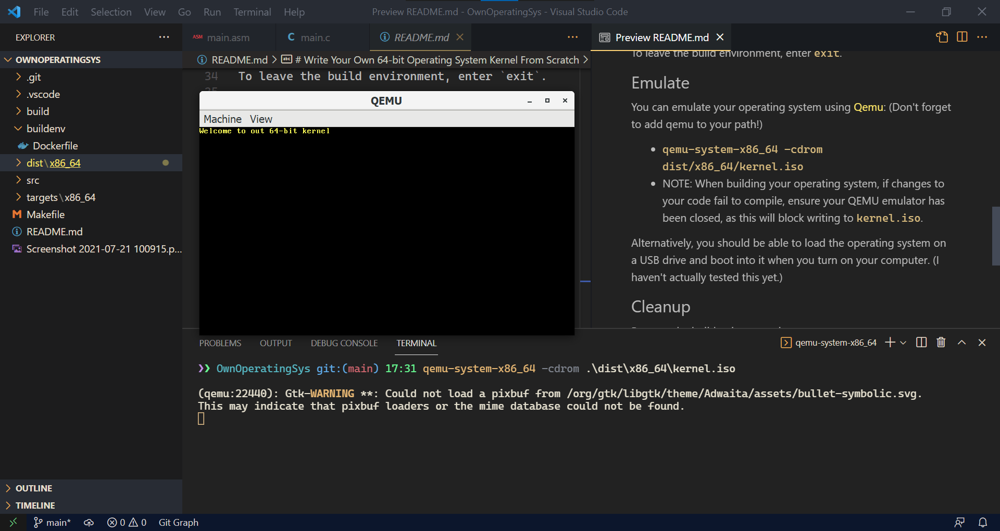

# Write Your Own 64-bit Operating System Kernel From Scratch

This respository holds all the source code for [this YouTube tutorial series](https://www.youtube.com/playlist?list=PLZQftyCk7_SeZRitx5MjBKzTtvk0pHMtp).

You can find the revision for a specific episode on [this page](https://github.com/davidcallanan/yt-os-series/tags).

You can find pre-built ISO files for this kernel at [this repository](https://github.com/davidcallanan/os-series-isos).

Considering supporting this work via [my Patreon page](http://patreon.com/codepulse).

## Prerequisites

 - A text editor such as [VS Code](https://code.visualstudio.com/).
 - [Docker](https://www.docker.com/) for creating our build-environment.
 - [Qemu](https://www.qemu.org/) for emulating our operating system.
   - Remember to add Qemu to the path so that you can access it from your command-line. ([Windows instructions here](https://dev.to/whaleshark271/using-qemu-on-windows-10-home-edition-4062))

## Setup

Build an image for our build-environment:
 - `docker build buildenv -t myos-buildenv`

## Build

Enter build environment:
 - Linux: `docker run --rm -it -v "$pwd":/root/env myos-buildenv`
 - MacOS: `docker run --rm -it -v "$PWD":/root/env myos-buildenv`
 - Windows (PowerShell): `docker run --rm -it -v "${pwd}:/root/env" myos-buildenv`
 > NOTE: If you are having trouble with an unshared drive, ensure your docker daemon has access to the drive you're development environment is in. For Docker Desktop, this is in "Settings > Shared Drives" or "Settings > Resources > File Sharing".

Build for x86 (other architectures may come in the future):
 - `make build-x86_64`

To leave the build environment, enter `exit`.

## Emulate

You can emulate your operating system using [Qemu](https://www.qemu.org/): (Don't forget to add qemu to your path!)

 - `qemu-system-x86_64 -cdrom dist/x86_64/kernel.iso`
 - NOTE: When building your operating system, if changes to your code fail to compile, ensure your QEMU emulator has been closed, as this will block writing to `kernel.iso`.

Alternatively, you should be able to load the operating system on a USB drive and boot into it when you turn on your computer. (I haven't actually tested this yet.)

## Cleanup

Remove the build-evironment image:
 - `docker rmi myos-buildenv -f`

## Results
